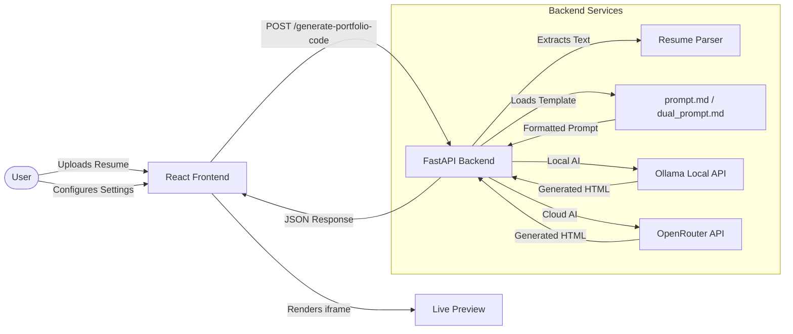

**Name**: Aarav
**Registration Number**: 23FE10CDS00478
**Branch**: Data Science (DS)
**Section**: G
**Project Title**: PortfolioGen
**GitHub Username**: AaroAarav
**Training Program**: NLP Project

# PortfolioGen

PortfolioGen is an AI-powered web application that instantly transforms your resume into a stunning, responsive, single-page professional portfolio website. 

By simply uploading a resume and selecting a theme, PortfolioGen parses your professional experience and leverages advanced AI (Local or Cloud) to generate clean, deployment-ready HTML and Tailwind CSS code that you can preview and download immediately.

## ✨ Key Features

- **Premium Modern UI:** A beautiful, glassmorphic React frontend with drag-and-drop uploads, interactive theme selection, and a mock macOS-style preview window.
- **Multiple AI Engines:**
  - **Local Generation (Ollama):** Run models like `llama3.2` locally for complete privacy.
  - **Cloud Generation (OpenRouter):** Access state-of-the-art models for high-quality generation.
  - **Dual Intelligence:** Uses Ollama for the initial HTML generation, then passes it to OpenRouter for a massive refinement and polish pass.
- **Multi-Format Parsing:** Upload resumes in PDF, DOCX, PNG, or JPG formats.
- **Curated Themes:** Choose from preset themes (Professional, Forest, Coffee, Space) or define a custom visual style. Our intelligent prompt loader injects specific hex codes dynamically.
- **Live Preview & Export:** Instantly preview the generated portfolio side-by-side with the raw HTML code, and download it with a single click.

## 🏛️ Architecture & Data Flow

The application features a React frontend and a FastAPI backend, utilizing specialized markdown prompts for maximum AI context efficiency.



## 📁 Project Structure

```
PortfolioGen/
├── backend/                  # FastAPI Backend API
│   ├── app/                  # Application code
│   │   ├── main.py           # FastAPI server and routing
│   │   ├── resume_parser.py  # File parsing logic (PDF, DOCX, Image OCR)
│   │   ├── ollama_client.py  # Local Ollama AI integration
│   │   ├── openrouter_client.py # Cloud OpenRouter AI integration
│   │   ├── prompts.py        # Dynamic prompt loader
│   │   ├── prompt.md         # Base generation system prompt
│   │   └── dual_prompt.md    # Refinement system prompt
│   ├── .env.example          
│   └── requirements.txt      
└── frontend/                 # React Frontend Application
    ├── public/               
    ├── src/                  
    │   ├── App.js            # Glassmorphic UI layout & logic
    │   ├── App.css           # Styling system & variables
    │   └── index.js          
    └── package.json          
```

## 🛠️ Technologies and Dependencies

**Frontend:**
- React 18+
- Axios
- Vanilla CSS (Glassmorphism, CSS Grid/Flexbox, CSS Variables)

**Backend:**
- Python 3.9+
- FastAPI & Uvicorn
- Requests (for API interactions)
- File Parsers: `PyPDF2` (PDFs), `python-docx` (Word Documents), `pytesseract` & `Pillow` (Images)

## 🚀 Installation & Setup

### Prerequisites
- Node.js (v18+)
- Python (v3.9+)
- [Ollama](https://ollama.com/) (Required if using Local or Dual Intelligence modes)
- Tesseract OCR (Required for image parsing)
  - **Windows:** Download from [UB-Mannheim](https://github.com/UB-Mannheim/tesseract/wiki)
  - **Mac:** `brew install tesseract`
  - **Linux:** `sudo apt install tesseract-ocr`

### 1. Backend Setup
Navigate to the `backend` directory and set up the Python environment:

```bash
cd backend
python -m venv venv
source venv/bin/activate  # On Windows: venv\Scripts\activate
pip install -r requirements.txt
```

### 2. Environment Variables
Create a `.env` file in the `backend` directory based on the provided example:

```bash
cp backend/.env.example backend/.env
```
Edit `backend/.env` and add your OpenRouter API Key:
```
OPENROUTER_KEY=your_actual_api_key_here
```

### 3. Frontend Setup
Navigate to the `frontend` directory and install dependencies:

```bash
cd frontend
npm install
```

## 🏃‍♂️ How to Run the Project

Ensure Ollama is running in the background if you plan to use local models (`ollama run llama3.2`).

You need to run both the backend and frontend servers simultaneously in separate terminal windows.

**Start the Backend (Terminal 1):**
```bash
cd backend
# Ensure virtual environment is activated
uvicorn app.main:app --reload --port 8000
```

**Start the Frontend (Terminal 2):**
```bash
cd frontend
npm start
```
*The React application will open in your browser at `http://localhost:3000`.*

## 📖 Usage Instructions

1. Open `http://localhost:3000` in your web browser.
2. Drag and drop your resume (PDF, DOCX, or Image) into the upload zone.
3. Select a **Theme** from the visual selector, or click **Custom** to type your own aesthetic.
4. Select your **AI Engine** (Ollama, OpenRouter, or Dual Engine).
5. (Optional) Enter specific **Extra Features** you want included in the HTML.
6. Click **"Generate My Portfolio"**.
7. Once complete, view the interactive result in the **Preview** window.
8. Switch to the **Source Code** tab to view/copy the raw HTML, or click **Download HTML**.

## 🔌 API Endpoints

### `POST /generate-portfolio-code/`
Generates portfolio HTML based on the provided resume and preferences.
- **Request Body (`multipart/form-data`):**
  - `file`: The resume file (PDF, DOCX, or image).
  - `theme`: A string describing the visual theme.
  - `features`: An optional string detailing specific feature requests.
  - `model`: AI model selection (`ollama`, `openrouter`, or `dual`).
- **Response (`application/json`):**
  - `html_code`: The generated HTML string.

## 🐛 Troubleshooting

- **"Error connecting to Ollama API":** Make sure the Ollama application is running on your machine and you have pulled the required model (`ollama pull llama3.2`).
- **"Missing 'choices' in OpenRouter response":** The cloud model may be temporarily overloaded. Try again in a few moments or switch to a different model in `openrouter_client.py`.
- **"Error processing image":** Ensure Tesseract OCR is installed and accessible in your system's PATH.
- **CORS Errors:** If the frontend cannot communicate with the backend, ensure the backend is running on exactly port `8000`.
